# Spring PetClinic Sample Application

This project is a fork of original Spring PetClinic application modified to
trigger inspections provided by IJ IDEA Ultimate.

## List of Inspections

| #   | Subsystem   | Inspection                                     | Highlighted for                                  |
|-----|-------------|------------------------------------------------|--------------------------------------------------|
| 1   | Spring Data | SpringDataRepositoryMethodParametersInspection | `PetRepository#findByType`                       |
| 2   |             | SpringDataMethodInconsistencyInspection        | `OwnerRepository#findByName`                     |
| 3   |             | SpringDataRepositoryMethodReturnTypeInspection | `PetRepository#findByName`                       |
| 4   | Spring Boot | SpringBootApplicationPropertiesInspection      | `application.properties`                         |
| 5   |             | SpringBootApplicationSetupInspection           | `PetClinicApplication`                           |
| 6   |             | ConfigurationPropertiesInspection              | `GeneralConfig`                                  |
| 7   | Spring Core | SpringAutowiringInspection                     | Owner, Pet & Vet controller constructors         |
| 8   |             | SpringJavaAutowiredFieldsWarningInspection     | `PetController#generalConfig`                    |
| 9   |             | SpringDependsOnUnresolvedBeanInspection        | `EntityRequestedEventPublisher`                  |
| 10  |             | ContextJavaBeanUnresolvedMethodsInspection     | `PetFormatterProvider#petFormatter`              |
| 11  |             | SpringCacheNamesInspection                     | `OwnerController#findAllOwners`                  |
| 12  |             | SpringEventListenerInspection                  | `EntityRequestedEventListener#onEntityRequested` |
| 13  |             | SpringComponentScanInspection                  | `PetClinicApplication`                           |
| 14  | Spring MVC  | SpringMVCViewInspection                        | `PetController#getAllPets`                       |
| 15  |             | MVCPathVariableInspection                      | `PetController#getAllPets`                       |

## Inspection Descriptions

### Spring Data

#### 1. Spring Data Repository Method Parameters Inspection

Reports Spring Data CRUD repository method parameters with incorrect types:

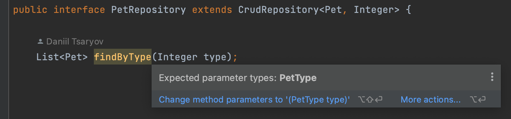

#### 2. Spring Data Method Inconsistency Inspection

Reports Spring Data CRUD repository methods for which the Spring Data Query
builder cannot generate the corresponding query.

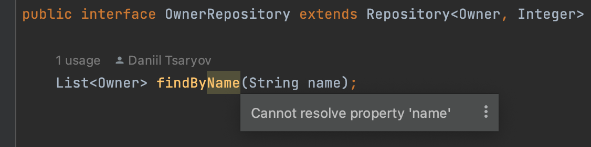

#### 3. Spring Data Repository Method Return Type Inspection

Reports Spring Data CRUD repository methods with incorrect return types:

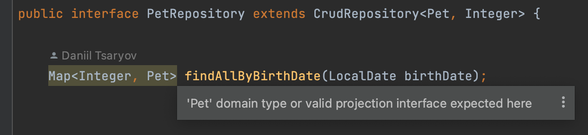

### Spring Boot

#### Spring Boot Application Properties Inspection

Reports unresolved and deprecated configuration keys and invalid values in
Spring Boot application `.properties` configuration files, which can lead
to runtime errors:

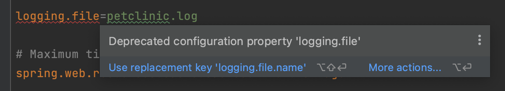

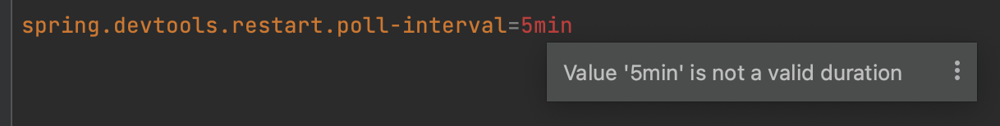

#### Spring Boot Application Setup Inspection

Reports `@SpringBootApplication` in the default package and redundant
`@EnableAutoConfiguration` or `@ComponentScan` annotations.
The quick-fix removes the redundant annotations:

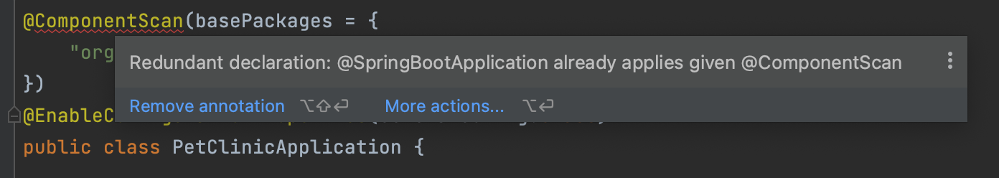

#### Configuration Properties Inspection

Reports invalid prefixes defined in the `@ConfigurationProperties` annotations:

* Missing prefix
* Empty prefix
* Duplicate prefix
* Prefix in notation other than kebab-case

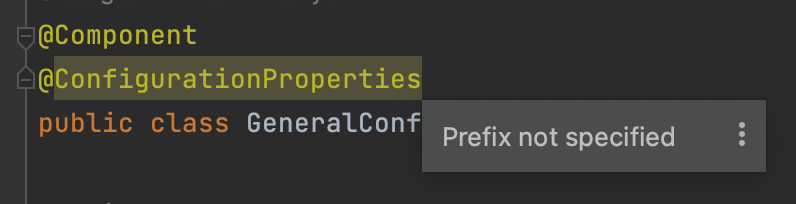

### Spring

#### Spring Autowiring Inspection

Reports autowiring problems on injection points of Spring beans:
 
* More than one bean of 'concrete' type

    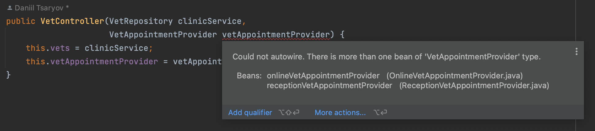

* No beans of 'concrete' type

    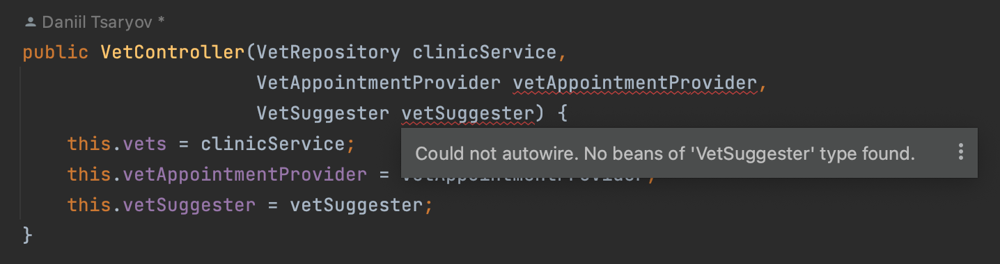

* No bean with qualifier

    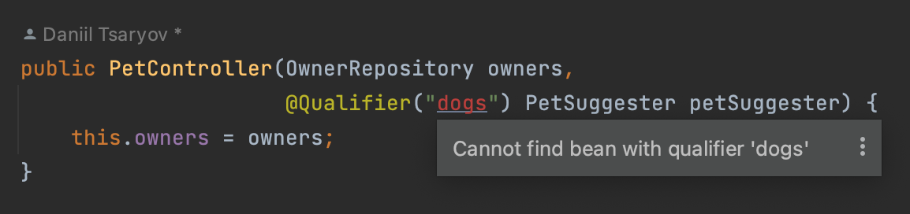

* Incorrect usages of `@Autowired` on Spring bean constructors

    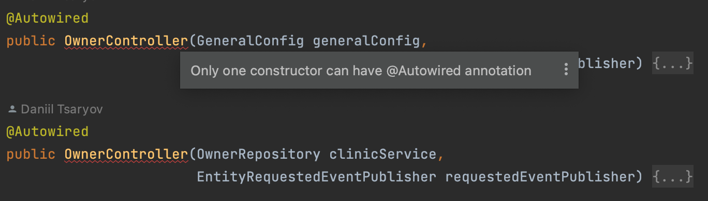

#### Spring Java Autowired Fields Warning Inspection

Reports injected or autowired fields in Spring components.

The quick-fix suggests the recommended constructor-based dependency injection
in beans and assertions for mandatory fields.

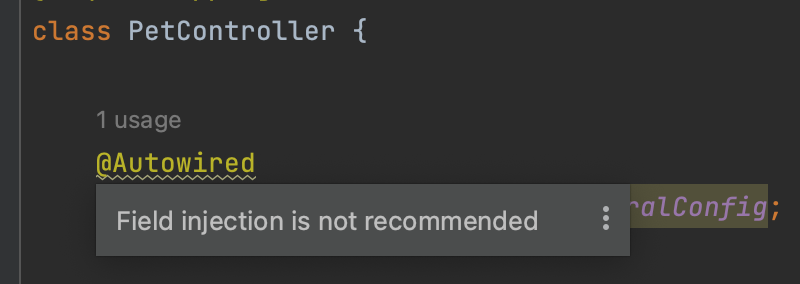

#### Spring Depends on Unresolved Bean Inspection

Reports incorrect bean references in the value parameter of the `@DependsOn` annotation:

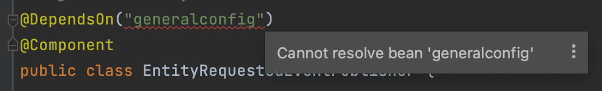

#### Context Java Bean Unresolved Methods Inspection

Reports unresolved method references on `initMethod` and `destroyMethod` parameters `@Bean` annotation:

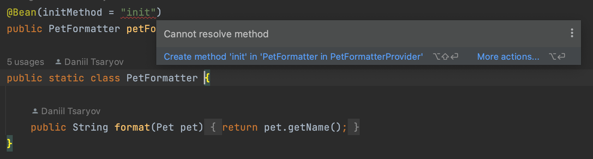

#### Spring Cache Names Inspection

Reports incorrect `@Cache*` annotation names.

At least one cache name should be provided per cache operation:
`@Cacheable("cache_name")` or `@Cacheable(cacheNames ="cache_name")`.

`@CacheConfig#cacheNames()` can be used for sharing common cache-related settings at the class level.

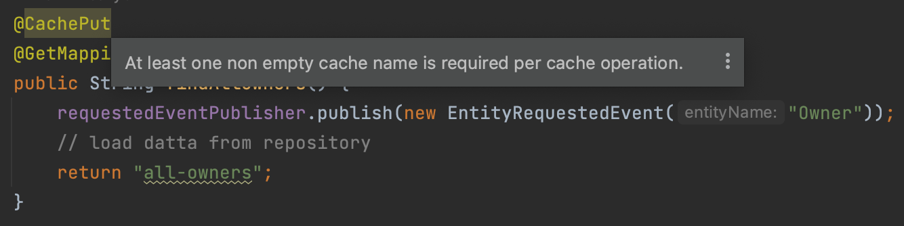

#### Spring Event Listener Inspection

Reports incorrect `@EventListener` methods:

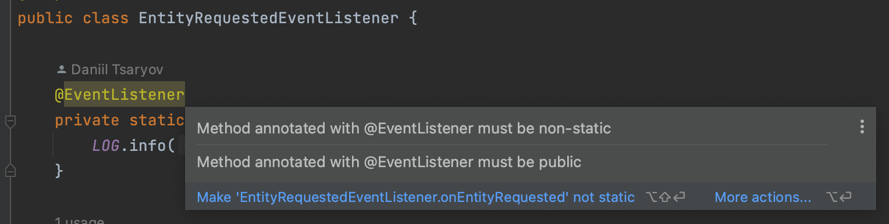

#### Spring Component Scan Inspection

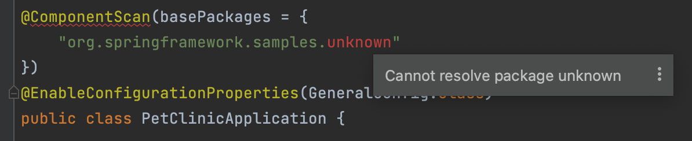

### Spring MVC

#### Spring MVC View Inspection

Reports unresolved Spring MVC View references:

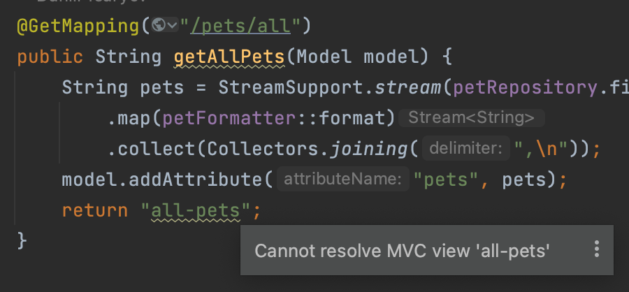

#### MVC Path Variable Inspection

Reports `@PathVariable` parameters that are declared in the method signature
but are absent in the URL path or vice versa. The quick-fix adds the missing parameter:

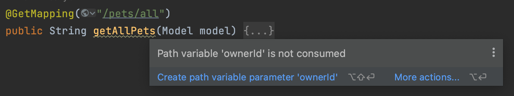
